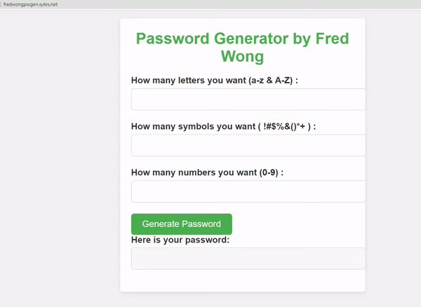

# Simple Password Generator (Web app version)

A web version of Simple Password Generator which can generate password randomly by user criteria (input amounts of letters/number/symbols).

## Demo

## Instruction
This app is write by html + css to decorate the website and Javascript(generate by CHATGPT lol, i didn't learn JS yet T.T) to push the python scripts into the html file.

I have a demo page to let you try out the app which is host on AWS EC2 and have created free domain by no-ip .
`http://fredwongpwgen.sytes.net/`

## How to deploy it onto AWS EC2
1. Create a AWS account 
2. Create a EC2 instance with AWS linux 2 image
3. Config the security group(inbound rules) to allow ssh(ports 22) , http(ports 80) , https(ports 443)
4. Install apache web server
         `sudo yum install httpd`
5. Start apache service
         `sudo systemctl start httpd`
6. Config the web server
         `sudo nano /etc/httpd/conf/httpd.conf`
       make sure config is like below:  

       `DocumentRoot "/var/www/html"`
       `<Directory "/var/www/html">`
       `Options Indexes FollowSymLinks`
       `AllowOverride All`
       `Require all granted`
       `</Directory>`
7. I use `winscp` to send the html file and css file into `/var/www/html`

     or you can `mkdir` a new html and css file then copy and paste the code  
       
8. run the command to make sure apache have right to access the html and css file
       `sudo chown apache:apache /var/www/htmlyour_html_file.html`
       `sudo chown apache:apache /var/www/html/your_css_file.css`

   if access denined, please `chmod +x <your.html>` to grant the access right 

 9. restart the server to let the server apply the code
       `sudo systemctl restart httpd`
10. You can access the web app via server public IP
11. You can assign a domain via Route 53 / other DNS .
